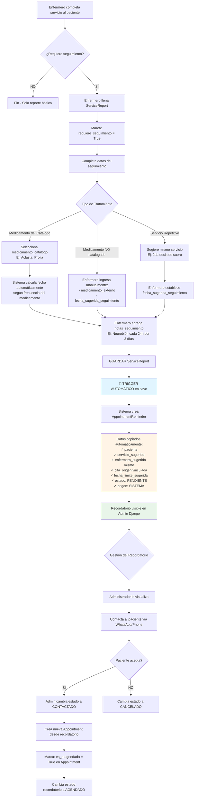
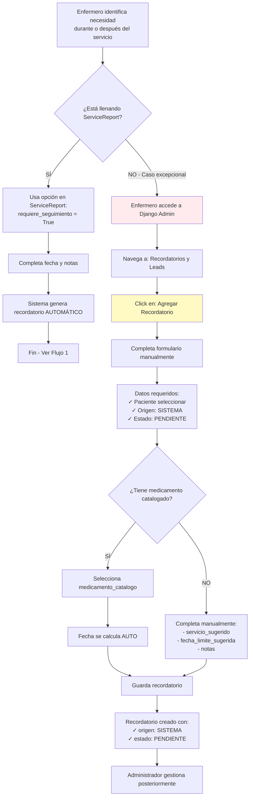
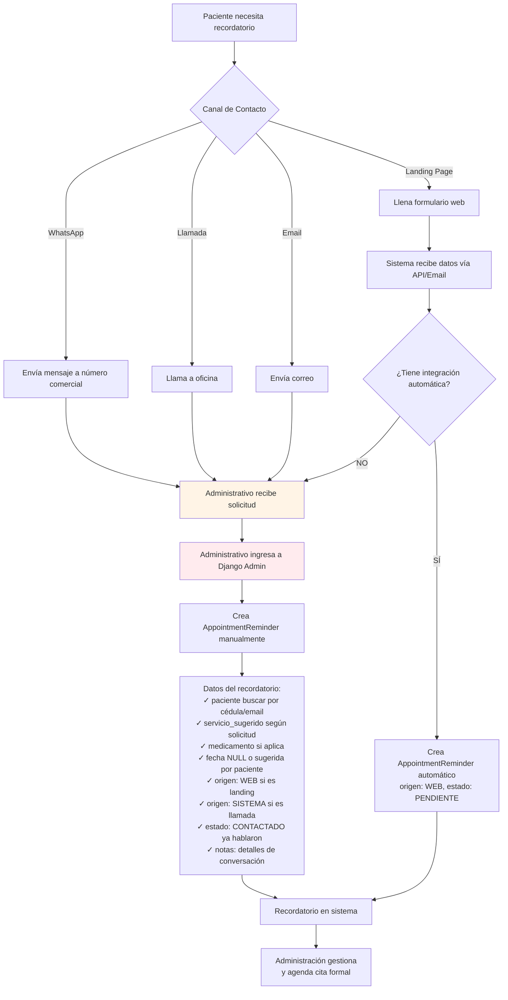
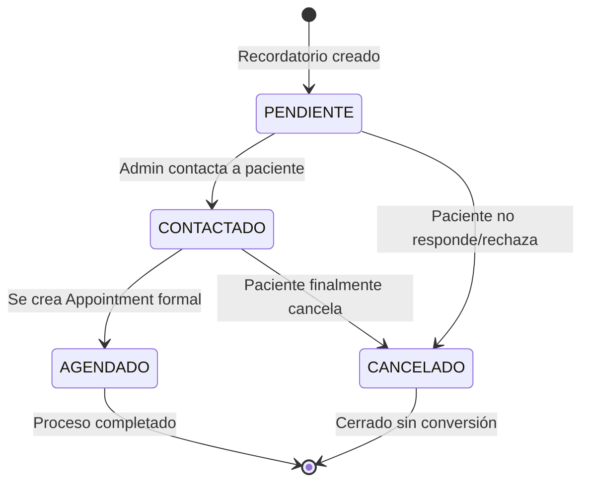
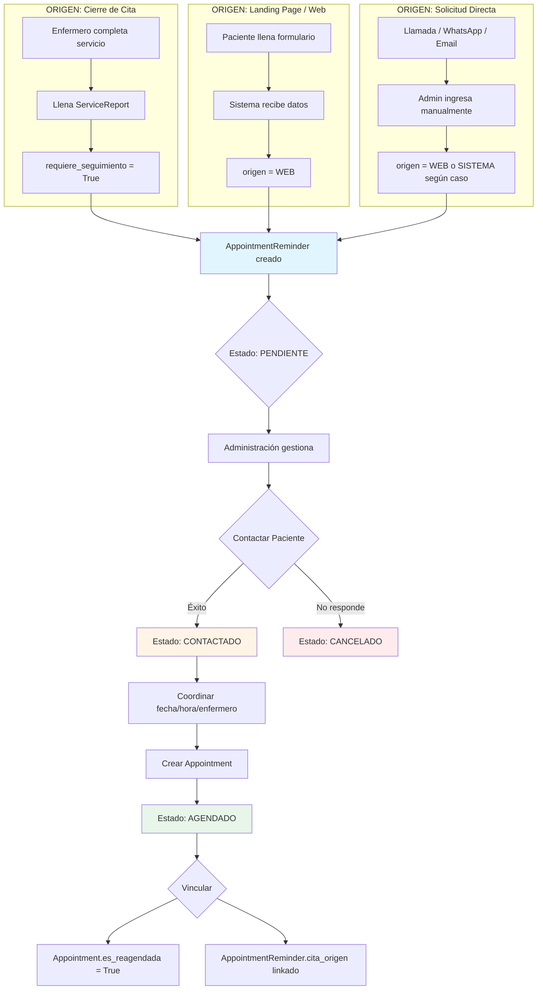

# Flujo de Trabajo de Recordatorios - HolaEnfermera

## Análisis del Sistema Actual

### Resumen de la Funcionalidad
El sistema HolaEnfermera cuenta con un módulo de **Recordatorios/Leads** ([AppointmentReminder](file:///c:/Users/danie/Documents/PROYECTOS_PROG/HOLAENFERMERA/HolaEnfermera/CoreApps/appointments/models.py#85-162)) que permite gestionar seguimientos de pacientes para:
- **Próximas dosis de medicamentos** (Ej: Aclasta cada 12 meses, Prolia cada 6 meses)
- **Continuidad de tratamientos** (Ej: Neurobión durante 3 días)
- **Captación de leads desde landing page** (Sin datos previos)

El modelo está diseñado para recibir recordatorios de **dos orígenes**:
1. **SISTEMA**: Generados automáticamente al cerrar una cita (vía [ServiceReport](file:///c:/Users/danie/Documents/PROYECTOS_PROG/HOLAENFERMERA/HolaEnfermera/CoreApps/reports/models.py#6-72))
2. **WEB**: Solicitudes desde formularios públicos (sin cita previa)

---

## Flujo 1: Recordatorios CON DATOS (Desde Citas/Medicamentos)

Este flujo ocurre cuando ya existe **una cita completada** y el enfermero identifica la necesidad de seguimiento.



### Datos Clave en este Flujo

| Campo | Origen | Valor Ejemplo |
|-------|--------|---------------|
| **paciente** | Copiado de `cita.paciente` | Juan Pérez |
| **servicio_sugerido** | Copiado de `cita.servicio` | Aplicación IM |
| **medicamento_catalogo** | Seleccionado por enfermero | Aclasta (cada 12 meses) |
| **fecha_limite_sugerida** | Auto-calculada O manual | 2025-11-24 (+1 año si es Aclasta) |
| **enfermero_sugerido** | Copiado de `cita.enfermero` | María González |
| **cita_origen** | Referencia a cita | Appointment #123 |
| **origen** | Automático | `SISTEMA` |
| **estado** | Inicial | `PENDIENTE` |

---

## Flujo 2: Recordatorios SIN DATOS (Solicitud desde Cero)

Este flujo maneja **leads puros** que llegan desde landing pages, formularios de contacto, o solicitudes manuales del administrador.

```mermaid
graph TD
    A[Usuario visita Landing Page] --> B[Llena formulario de contacto]
    B --> C[Datos solicitados:<br/>✓ Nombre completo<br/>✓ Email<br/>✓ Teléfono<br/>✓ Cédula opcional<br/>✓ Servicio de interés opcional<br/>✓ Comentarios]
    
    C --> D[Usuario envía formulario]
    
    D --> E{¿Sistema tiene endpoint API?}
    E -->|NO - Opción Temporal| F1[Email con los datos se envía<br/>a admin@holaenfermera.com]
    F1 --> F2[Administrador recibe email]
    F2 --> F3[Admin ingresa manualmente<br/>a Django Admin]
    
    E -->|SÍ - Implementación Futura| G1[POST /api/recordatorios/crear/]
    G1 --> G2[Backend recibe JSON]
    
    F3 --> H[Crear AppointmentReminder manualmente]
    G2 --> I[Sistema crea AppointmentReminder automático]
    
    H --> J[Completar datos mínimos]
    I --> J
    
    J --> K[Datos del recordatorio sin cita:<br/>✓ paciente buscar/crear<br/>✓ servicio_sugerido NULL o seleccionado<br/>✓ medicamento_catalogo NULL<br/>✓ medicamento_externo NULL<br/>✓ fecha_limite_sugerida NULL<br/>✓ notas comentarios del usuario<br/>✓ origen: WEB<br/>✓ estado: PENDIENTE]
    
    K --> L[Recordatorio guardado en sistema]
    
    L --> M{Gestión del Lead}
    M --> N1[Administrador revisa leads nuevos]
    N1 --> N2[Filtra por origen: WEB]
    N2 --> N3[Contacta al paciente]
    
    N3 --> O{Paciente responde?}
    O -->|SÍ| P1[Cambia estado a CONTACTADO]
    P1 --> P2[Define: servicio + fecha + enfermero]
    P2 --> P3[Crea Appointment formal]
    P3 --> P4[Cambia estado a AGENDADO]
    
    O -->|NO| Q1[Marca como CANCELADO]
    
    style G1 fill:#fff4e6
    style I fill:#e8f5e9
    style F1 fill:#ffebee
```



### Datos Clave en este Flujo

| Campo | Origen | Valor Ejemplo |
|-------|--------|---------------|
| **paciente** | Usuario del formulario (buscar/crear) | nueva.persona@gmail.com |
| **servicio_sugerido** | Opcional desde formulario | NULL o "Aplicación IM" |
| **medicamento_catalogo** | No aplica | NULL |
| **medicamento_externo** | No aplica | NULL |
| **fecha_limite_sugerida** | No aplica | NULL |
| **enfermero_sugerido** | No aplica | NULL |
| **cita_origen** | No existe | NULL |
| **origen** | Formulario web | `WEB` |
| **estado** | Inicial | `PENDIENTE` |
| **notas** | Comentarios del usuario | "Me interesa agendar aplicación de Prolia" |

---

## Flujo 3: Enfermero Solicita Recordatorio (Sin Frontend)

Actualmente **NO existe interfaz frontend**, por lo que el enfermero debe usar **Django Admin** para crear recordatorios.



---

## Flujo 4: Paciente Usuario Solicita Recordatorio (Sin Frontend App/Web)

Sin aplicación web o móvil, el paciente **NO puede crear recordatorios directamente**. Debe pasar por canales externos.



---

## Propuesta de Implementación de APIs (Futuro)

Para poder recibir solicitudes **sin intervención manual**, se necesitan estos endpoints:

### API 1: Crear Lead desde Landing Page

```http
POST /api/recordatorios/lead/
Content-Type: application/json

{
  "nombres": "Juan",
  "apellidos": "Pérez",
  "email": "juan@example.com",
  "telefono": "+593987654321",
  "cedula": "1234567890",
  "servicio_interes": "Aplicación IM",
  "comentarios": "Me gustaría agendar aplicación de Prolia"
}
```

**Respuesta esperada:**
```json
{
  "status": "success",
  "recordatorio_id": 45,
  "mensaje": "Solicitud recibida. Nos contactaremos pronto."
}
```

**Lógica Backend:**
1. Buscar o crear `User` con rol `CLIENTE`
2. Crear [AppointmentReminder](file:///c:/Users/danie/Documents/PROYECTOS_PROG/HOLAENFERMERA/HolaEnfermera/CoreApps/appointments/models.py#85-162):
   - `origen = 'WEB'`
   - `estado = 'PENDIENTE'`
   - `paciente = usuario_encontrado_o_creado`
   - `servicio_sugerido = Service.objects.get(nombre__icontains=servicio_interes)` si aplica
   - `notas = comentarios`

---

### API 2: Consultar Estado de Recordatorio (Futuro Portal Paciente)

```http
GET /api/recordatorios/mis-recordatorios/
Authorization: Bearer {token_paciente}
```

**Respuesta esperada:**
```json
{
  "recordatorios": [
    {
      "id": 45,
      "servicio": "Aplicación IM",
      "medicamento": "Prolia",
      "fecha_sugerida": "2025-06-15",
      "estado": "CONTACTADO",
      "notas": "Pendiente confirmar horario"
    }
  ]
}
```

---

## Estados del Recordatorio



| Estado | Significado | Acción Siguiente |
|--------|-------------|------------------|
| **PENDIENTE** | Recordatorio creado, aún no gestionado | Contactar al paciente |
| **CONTACTADO** | Ya se habló con el paciente | Coordinar fecha y crear cita |
| **AGENDADO** | Se convirtió en Appointment formal | Ejecutar el servicio |
| **CANCELADO** | Lead descartado o paciente no interesado | Archivar |

---

## Diagrama General del Sistema de Recordatorios



---

## Recomendaciones de Implementación

### Corto Plazo (Sin Frontend)

> [!IMPORTANT]
> **Uso exclusivo de Django Admin** hasta que se desarrolle el frontend.

1. **Para Enfermeros:**
   - Capacitar en el uso de [ServiceReport](file:///c:/Users/danie/Documents/PROYECTOS_PROG/HOLAENFERMERA/HolaEnfermera/CoreApps/reports/models.py#6-72) con la opción `requiere_seguimiento`
   - Proveer guía de cuándo seleccionar medicamentos del catálogo vs externo
   - Enseñar a calcular fechas para medicamentos no catalogados

2. **Para Administración:**
   - Configurar filtros en Admin Django:
     - Por `estado`
     - Por `origen`
     - Por `fecha_limite_sugerida`
   - Crear vistas personalizadas para priorizar recordatorios próximos a vencer
   - Implementar notificaciones internas (email) cuando se crea un recordatorio nuevo

3. **Para Leads desde Web:**
   - Configurar formulario en landing page que envíe email a admin
   - Template de email estructurado con todos los datos necesarios
   - Admin copia y pega datos en Django Admin

### Mediano Plazo (Con Frontend Básico)

> [!TIP]
> **Portal Web para Administración** que facilite la gestión sin entrar al Django Admin.

1. **Panel de Administración:**
   - Dashboard con recordatorios pendientes
   - Formulario para crear recordatorios manualmente
   - Vista de calendario con fechas sugeridas
   - Botón rápido "Convertir en Cita" desde recordatorio

2. **API Pública:**
   - Endpoint `/api/recordatorios/lead/` para formulario landing page
   - Validaciones automáticas de datos
   - Respuestas JSON estructuradas

### Largo Plazo (App Móvil / Portal Paciente)

> [!NOTE]
> **Aplicación completa** donde pacientes puedan gestionar sus propios recordatorios.

1. **Portal Paciente:**
   - Vista de "Mis Recordatorios"
   - Solicitar nuevo recordatorio
   - Confirmar/Rechazar citas sugeridas
   - Chat directo con administración

2. **App Móvil Enfermero:**
   - Crear recordatorios desde la app después del servicio
   - Sincronización automática con backend
   - Notificaciones push para recordatorios asignados

---

## Ejemplo Práctico Completo

### Caso: Don Carlos necesita Aplicación de Aclasta (cada 12 meses)

#### Paso 1: Servicio Inicial
- **Fecha:** 2024-11-20
- **Servicio:** Aplicación IM - Aclasta (Primera dosis)
- **Enfermera:** María González
- **Paciente:** Carlos Mora (Cédula: 1234567890)

#### Paso 2: Cierre del Servicio
Enfermera María completa el [ServiceReport](file:///c:/Users/danie/Documents/PROYECTOS_PROG/HOLAENFERMERA/HolaEnfermera/CoreApps/reports/models.py#6-72):
- ✅ `requiere_seguimiento = True`
- 📅 Selecciona `medicamento_catalogo = Aclasta` (configurado como "cada 12 meses")
- 📝 `notas_seguimiento = "Paciente debe aplicarse próxima dosis en 12 meses"`

#### Paso 3: Sistema Genera Recordatorio Automático
```python
AppointmentReminder.objects.create(
    paciente=carlos_mora,  # Copiado de cita
    servicio_sugerido=aplicacion_im,  # Mismo servicio
    medicamento_catalogo=aclasta,  # Seleccionado por enfermera
    cita_origen=cita_123,  # Referencia a cita original
    enfermero_sugerido=maria_gonzalez,  # Misma enfermera
    fecha_limite_sugerida=date(2025, 11, 20),  # AUTO-CALCULADA: +12 meses
    origen='SISTEMA',
    estado='PENDIENTE',
    notas='Paciente debe aplicarse próxima dosis en 12 meses'
)
```

#### Paso 4: Gestión Administrativa (Octubre 2025)
Admin revisa recordatorios próximos (1 mes antes):
- Filtra: `fecha_limite_sugerida` entre 2025-10-20 y 2025-11-20
- Ve recordatorio de Don Carlos
- Contacta vía WhatsApp: "Don Carlos, es momento de su próxima dosis de Aclasta"

#### Paso 5: Conversión a Cita
Don Carlos acepta:
- Admin cambia estado a `CONTACTADO`
- Crea nueva [Appointment](file:///c:/Users/danie/Documents/PROYECTOS_PROG/HOLAENFERMERA/HolaEnfermera/CoreApps/appointments/models.py#14-83):
  - `fecha = 2025-11-18` (coordinada con paciente)
  - `hora_inicio = 10:00`
  - `enfermero = maria_gonzalez` (si está disponible)
  - `es_reagendada = True` (marca que viene de recordatorio)
- Cambia estado del recordatorio a `AGENDADO`

#### Paso 6: ¡Ciclo se repite!
Cuando María complete el servicio en Nov 2025, nuevamente llenará el reporte y generará otro recordatorio para Nov 2026. 🔄

---

## Conclusión

El sistema de recordatorios de HolaEnfermera está **bien diseñado** para funcionar con o sin frontend, usando dos flujos principales:

1. **CON DATOS:** Automatización completa desde citas existentes (ideal para tratamientos continuos)
2. **SIN DATOS:** Captación manual de leads desde web o contactos externos

**Estado Actual:** Funcional 100% vía Django Admin  
**Próximos Pasos:** APIs para formularios + Panel administrativo básico  
**Visión Futura:** Portal paciente + App móvil enfermero

