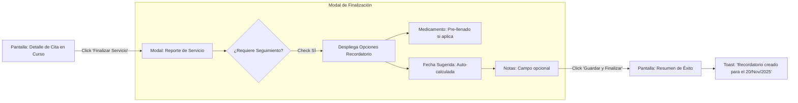
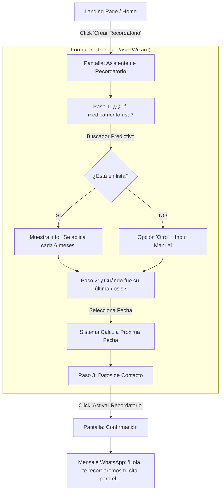

# Propuesta Conceptual de UI/UX: Sistema de Recordatorios

Este documento propone el **Flujo de Interfaz de Usuario (UI)** y la **Experiencia de Usuario (UX)** para la funcionalidad de Recordatorios en _HolaEnfermera_.

Dado que el Frontend aún no existe, estos diagramas sirven como **guía de diseño** para el desarrollo futuro de las pantallas.

---

## 1. Concepto General

El objetivo es minimizar la fricción para el usuario.

- **Para el Enfermero:** El recordatorio debe ser un paso natural al finalizar un servicio.
- **Para el Paciente:** La solicitud debe ser tan simple como "Pedir un Uber", sin necesidad de conocimientos médicos complejos.

---

## 2. Escenario A: Flujo CON DATOS (Post-Cita)

**Actor:** Enfermero / Administrador  
**Contexto:** Se acaba de realizar una cita y se desea programar la siguiente dosis o seguimiento.

### Diagrama de Flujo de Pantallas (Wireflow)

### Detalle de la Interfaz Propuesta

#### 1. Modal de Reporte de Servicio

Al hacer clic en "Finalizar", no solo se cierra la cita, sino que se ofrece la **continuidad**.

- **Switch / Checkbox:** `¿Programar recordatorio para próxima dosis?`
- **Lógica Inteligente:**
  - Si el servicio fue "Aplicación de Aclasta", el sistema detecta que es "Cada 1 Año".
  - **Campo Medicamento:** Muestra "Aclasta" (Bloqueado o editable).
  - **Campo Fecha:** Muestra "20 Noviembre 2025" (Calculado: Hoy + 1 año).
  - **Campo Comentarios:** Espacio para notas específicas (ej: "Paciente prefiere turno mañana").

#### 2. Feedback Inmediato

Una vez guardado, el sistema debe confirmar visualmente:

- _"Cita finalizada correctamente."_
- _"Se ha programado un recordatorio automático para el [Fecha]."_

---

## 3. Escenario B: Flujo SIN DATOS (Solicitud Web / Paciente)

**Actor:** Paciente (Nuevo o Recurrente)  
**Contexto:** El usuario entra a la web porque necesita que le recuerden su medicamento, pero no tiene una cita activa en este momento.

### Diagrama de Flujo de Pantallas (Wireflow)

### Detalle de la Interfaz Propuesta

#### 1. El "Asistente" (Wizard)

En lugar de un formulario largo y aburrido, proponemos un asistente paso a paso:

- **Paso 1: El Medicamento**

  - Un buscador grande (tipo Google).
  - Al escribir "Pro", sugiere "Prolia (Denosumab) - Cada 6 meses".
  - Esto reduce errores y estandariza la data.

- **Paso 2: La Fecha**

  - Pregunta clave: _"¿Cuándo te aplicaste la última dosis?"_
  - Calendario visual.
  - **Feedback Inmediato:** Al seleccionar la fecha, aparece un texto dinámico: _"¡Entendido! Tu próxima dosis debería ser el [Fecha Calculada]. Te avisaremos unos días antes."_

- **Paso 3: El Contacto**
  - Si el usuario no está logueado: Pedir WhatsApp y Nombre.
  - Si está logueado: Confirmar datos existentes.

#### 2. La Confirmación

- Pantalla de éxito con un resumen claro.
- Botón (Call to Action): _"Agendar cita ahora"_ (Opcional, por si ya quiere dejarla lista, aunque falten meses).

---

## 4. Estrategia "Sin Frontend" (Interim)

Mientras se desarrolla la interfaz descrita arriba, se puede implementar este flujo de trabajo utilizando herramientas existentes:

### Flujo Alternativo Actual

1.  **Formulario Web (Google Forms / Typeform):**

    - Crear un formulario con los campos: Medicamento, Fecha Última Dosis, Nombre, Teléfono.
    - Incrustar el link en la página actual o redes sociales.

2.  **Recepción (Manual/Semi-Auto):**

    - El Administrador recibe el correo del formulario.
    - Ingresa al **Django Admin** -> `Appointment Reminders`.
    - Crea el registro copiando los datos.

3.  **Gestión:**
    - El sistema backend (ya existente) se encarga de mantener el estado y la fecha.

---

## Resumen de Datos Necesarios por Flujo

| Dato              | Flujo Post-Cita (Automático) | Flujo Web (Manual/Usuario)            |
| :---------------- | :--------------------------- | :------------------------------------ |
| **Paciente**      | Heredado de la Cita          | Input: Nombre + Teléfono              |
| **Medicamento**   | Heredado del Servicio        | Input: Selección de Catálogo          |
| **Fecha Base**    | Fecha de la Cita (Hoy)       | Input: Fecha Última Dosis             |
| **Frecuencia**    | Automática (Base de Datos)   | Automática (si es catálogo) o Manual  |
| **Próxima Fecha** | Calculada (Hoy + Frecuencia) | Calculada (Última Dosis + Frecuencia) |
